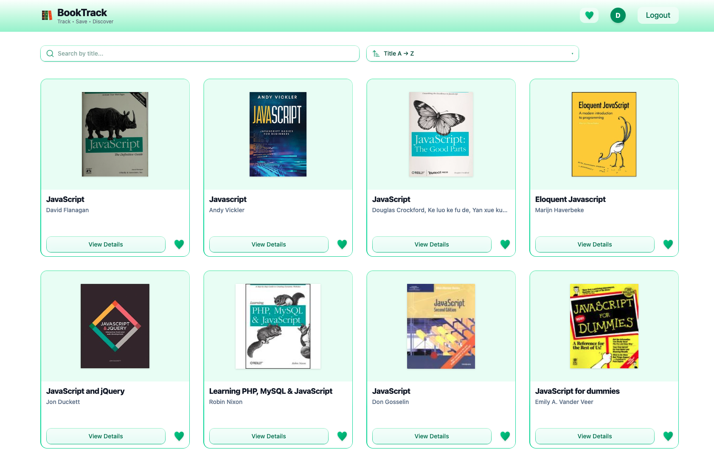

<div align="center">

# 📚 BookTrack
### Track • Save • Discover — your personal reading list manager

🌐 **Live demo:**  
👉 https://nadiaturko.github.io/booktrack/

<p align="center">
  
</p>

<p>
  <a href="https://react.dev/">
    
  </a>
  <a href="https://vite.dev/">
    
  </a>
  <a href="https://firebase.google.com/">
    
  </a>
  <a href="https://tailwindcss.com/">
    
  </a>
  
</p>

</div>

---

## ✨ About the Project

**BookTrack** is a user-focused web application designed for readers who want to organize, track, and manage their personal reading lists.

The app allows users to search for books, save favorites, track reading status (*read / unread*), and filter content efficiently, making reading planning simple and structured.

---

## 🚀 Features

- 🔍 Search books via external API  
- ❤️ Add and remove books from favorites  
- ✅ Track reading status (*Read / Unread*)  
- 📂 Filter and sort favorite books  
- 👤 User authentication with Firebase  
- 🔐 Protected routes for authorized users  
- 💾 Persistent data storage  
- 📱 Fully responsive UI  

---

## 🧰 Tech Stack

- **React 18+** — UI development  
- **React Router** — client-side routing  
- **Firebase Authentication** — user authentication  
- **Formik** — form handling and validation  
- **Tailwind CSS** — styling  
- **Vite** — fast build tool  
- **ESLint** — code quality  
- **Custom React Hooks & Context API** — state and logic management  

---

## ⚙️ Getting Started

### 1️⃣ Clone the repository
```bash
git clone https://github.com/NadiaTurko/booktrack.git
cd booktrack
