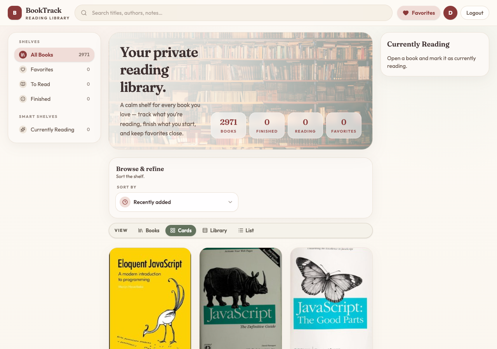
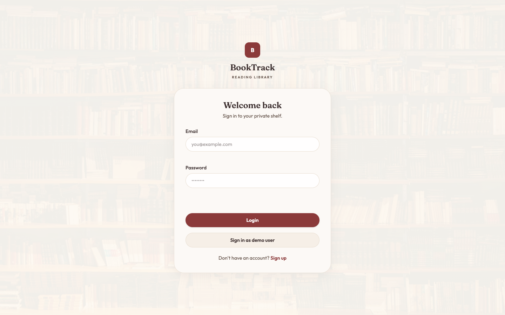

<div align="center">

# BookTrack

**Your private reading library** — browse books, keep shelves tidy, and jot down notes as you read.

[](https://nadiaturko.github.io/booktrack/)
[](https://react.dev/)
[](https://www.typescriptlang.org/)
[](https://vite.dev/)
[](https://firebase.google.com/)
[](https://tailwindcss.com/)

[Live demo](https://nadiaturko.github.io/booktrack/) · [Report bug](https://github.com/NadiaTurko/booktrack/issues) · [Request feature](https://github.com/NadiaTurko/booktrack/issues)

<br />



</div>

---

## About

BookTrack is a React web app for organizing a personal reading list. Search books from [Open Library](https://openlibrary.org/), save favorites, track **To Read** / **Finished** shelves, switch between view modes, and keep reading notes & quotes on each book’s details page.

Data for shelves and journal entries is stored per user in `localStorage`; authentication is handled by Firebase.

---

## Features

- Browse and search books via the Open Library API
- Favorites with **To Read** and **Finished** shelf status
- Multiple view modes: Books, Cards, Library, List
- Sort & filter on the library and favorites pages
- Book details with description, shelf controls, and a reading journal (notes, quotes, place)
- Firebase email/password auth with protected routes
- Responsive cozy “reading library” UI (cream / burgundy)

---

## Screenshots

<p align="center">
  
  &nbsp;
  
</p>

---

## Tech stack

| Layer | Tools |
| --- | --- |
| UI | React 19, TypeScript, React Router 7 |
| Styling | Tailwind CSS 4, Lucide icons |
| Auth | Firebase Authentication |
| Forms | Formik + Yup |
| Data | Open Library API, localStorage repositories |
| Architecture | Context API, shared hooks, repository interfaces |
| Tooling | Vite 7, ESLint, React Compiler, gh-pages |

---

## Getting started

### Prerequisites

- Node.js 20+ (recommended)
- npm 10+

### Install & run

```bash
git clone https://github.com/NadiaTurko/booktrack.git
cd booktrack
npm install
npm run dev
```

Open the local URL printed by Vite (base path: `/booktrack/`).

### Demo account

On the login screen you can use **Sign in as demo user**, or:

| Field | Value |
| --- | --- |
| Email | `demo@demo.com` |
| Password | `demo1234` |

> The demo user must exist in the Firebase Auth project linked to this app.

### Scripts

| Command | Description |
| --- | --- |
| `npm run dev` | Start Vite dev server |
| `npm run build` | Typecheck + production build |
| `npm run typecheck` | `tsc --noEmit` |
| `npm run preview` | Preview the production build |
| `npm run lint` | Run ESLint |
| `npm run deploy` | Build and publish to GitHub Pages |

---

## Project structure

```text
src/
  components/     # Presentational UI (BookCard views, filters, layout)
  containers/     # Page orchestrators
  context/        # Auth, books, favorites, journal providers
  domain/         # Repository interfaces (DIP)
  hooks/          # Shared library & auth hooks
  repositories/   # localStorage implementations
  routes/         # App routes & protected route
  services/       # Firebase auth helpers
  types/          # Shared TypeScript types
```

---

## License

This project is available under the [ISC](https://opensource.org/licenses/ISC) license.
